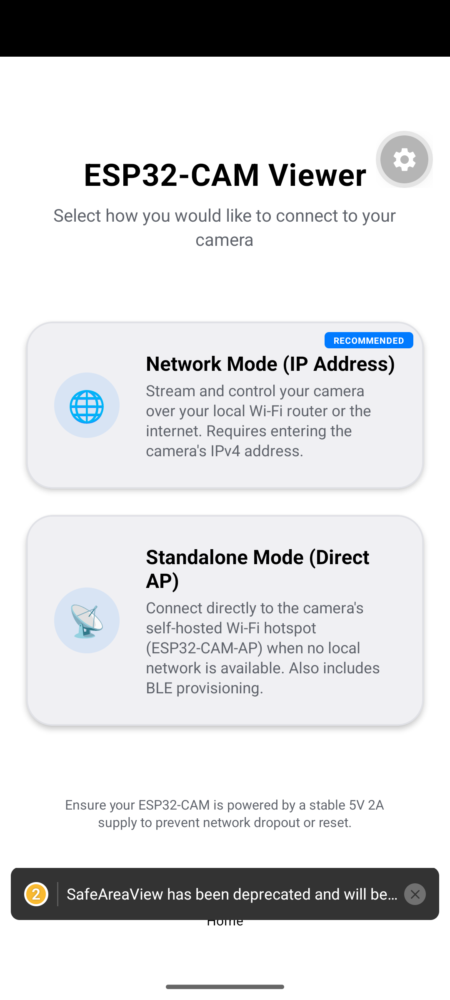
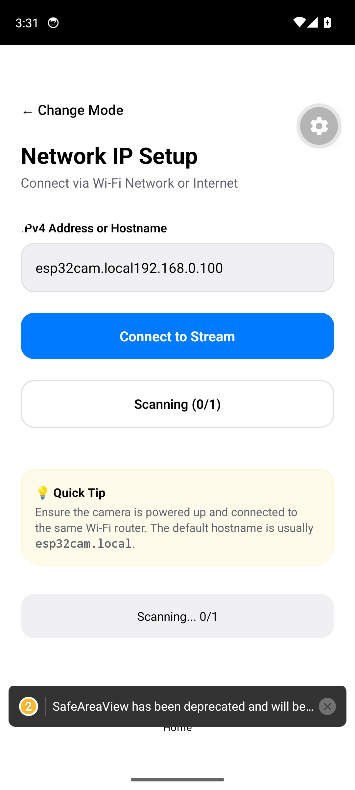

# ESP32-CAM Integration Guide

## Hardware

- **Board**: AI-Thinker ESP32-CAM (must have **PSRAM** — the black PCB version)
- **Camera**: OV2640 2MP sensor
- **Flash LED**: GPIO 4 (white bright LED on the board)
- **Power**: 5V 2A minimum — USB from many computers may be insufficient, use a dedicated power supply if experiencing resets

### Pinout Reference

| Pin | Function |
|-----|----------|
| GPIO 4 | Flash LED |
| GPIO 0 | Boot mode (hold LOW during reset for flashing) |
| GPIO 2 | Status LED (on some boards) |
| GPIO 12 | ESP32-CAM-Flash (tied to camera) |

## Flashing the Firmware

### Prerequisites

- Arduino IDE (1.8.x or 2.x)
- ESP32 board package v2.x installed via Boards Manager
- USB-to-UART bridge (e.g., FTDI232) at 3.3V
- Connections: UART TX → ESP32 RX, UART RX → ESP32 TX, GND → GND, 5V → 5V

### Board Configuration

| Setting | Value |
|---------|-------|
| Board | AI Thinker ESP32-CAM |
| Upload Speed | 115200 |
| Flash Frequency | 80MHz |
| Flash Mode | QIO |
| Partition Scheme | Huge APP (3MB No OTA/1MB SPIFFS) |
| PSRAM | Enabled |

### Steps

1. Open `esp32-cam-firmware/esp32-cam-firmware.ino` in Arduino IDE
2. Install dependencies via Boards Manager: `ESP32 by Espressif Systems` v2.x
3. Set your WiFi credentials at the top of the file:
   ```cpp
   #define WIFI_SSID "YourWiFiSSID"
   #define WIFI_PASSWORD "YourWiFiPassword"
   ```
4. Select **Tools > Board > ESP32 Arduino > AI Thinker ESP32-CAM**
5. Select the correct COM port
6. Hold GPIO 0 to GND, press reset, release GPIO 0
7. Click **Upload**
8. Open **Serial Monitor** at 115200 baud to see the assigned IP

> If you see `FB-OVF` errors in the serial log, you have an older firmware. The current firmware boots the camera AFTER WiFi connects to prevent this.

### Firmware Architecture

The firmware runs two HTTP servers concurrently using ESP-IDF's `esp_http_server`:

```
Port 80 (camera_httpd)
├── GET /status   → JSON sensor state
├── GET /control  → Set sensor parameter (?var=X&val=Y)
└── GET /capture  → Single JPEG frame

Port 81 (stream_httpd)
└── GET /stream   → Multipart MJPEG stream
```

Each endpoint runs in its own FreeRTOS task, so streaming never blocks control commands.

## Connecting

### Network Mode (Recommended)

1. ESP32 connects to your WiFi router on boot
2. Find its IP via Serial Monitor, router DHCP list, or the app's **Scan** button
3. Enter the IP in the app or tap the discovered camera


*Mode selection: choose between Network IP or Standalone AP*


*Enter the camera IP or tap Scan to auto-discover*


*Scanning the local network for ESP32-CAM devices*

### Standalone AP Mode

1. If WiFi connection fails, ESP32 creates its own network: `ESP32-CAM-AP` (no password)
2. Phone connects to that network
3. Default IP: `192.168.4.1`
4. Use **Configure Camera Wi-Fi (BLE)** to send router credentials via Bluetooth

### mDNS

The firmware advertises as `esp32cam.local`. Not all networks resolve mDNS reliably — use IP directly if mDNS fails.

## Control Commands

All controls go to `http://{ip}/control?var={name}&val={value}`:

### Flash
- `flash=1` — on
- `flash=0` — off

### Resolution (`framesize`)
| Value | Resolution |
|-------|-----------|
| 10 | UXGA (1600×1200) |
| 7 | SVGA (800×600) |
| 6 | VGA (640×480) |
| 5 | CIF (400×296) |

### Image Adjustment
| var | Range |
|-----|-------|
| `quality` | 6–15 (lower = smaller file) |
| `brightness` | -2 to 2 |
| `contrast` | -2 to 2 |
| `saturation` | -2 to 2 |
| `sharpness` | -3 to 3 |

### Flip/Mirror
- `hmirror=1` — horizontal mirror
- `vflip=1` — vertical flip

### Auto Settings
| var | 0/1 | Description |
|-----|-----|-------------|
| `awb` | off/on | Auto white balance |
| `agc` | off/on | Auto gain control |
| `aec` | off/on | Auto exposure control |
| `ae_level` | -3 to 3 | AE compensation |

### Effects
- `special_effect` 0–6 (0=none, 1=negative, 2=grayscale, etc.)
- `wb_mode` 0–4 (white balance presets)

## Status Endpoint

`GET http://{ip}/status` returns all sensor state as JSON:

```json
{"flash":false,"framesize":7,"quality":10,"brightness":0,
 "contrast":0,"saturation":0,"sharpness":0,"hmirror":0,
 "vflip":0,"ae_level":0,"awb":1,"agc":1,"aec":1,
 "special_effect":0,"wb_mode":0}
```

## Troubleshooting

| Symptom | Cause | Fix |
|---------|-------|-----|
| Camera not found | Different subnet | Use Scan in app or check router DHCP list |
| FB-OVF at boot | Camera init before WiFi stable | Flash current firmware (moves init after WiFi) |
| Black stream | Wrong resolution/quality | Tap Refresh or lower quality slider |
| Emulator no camera | NAT isolation | Server-side scan auto-detected (10.0.2.x) |
| Stream freezes | Power brownout | Use 5V 2A supply, not USB from PC |
| Can't flash ESP32 | GPIO 0 not held low | Hold GPIO 0 to GND during reset |
| BLE not working | `WIFI_SSID` defined | BLE only active in AP fallback mode |

## BLE Provisioning

When WiFi credentials are NOT pre-defined (remove `#define WIFI_SSID` line), the firmware enables BLE:

1. ESP32 advertises as `ESP32-CAM-SETUP`
2. App scans for BLE devices in Standalone mode
3. User enters router SSID + password
4. ESP32 connects to WiFi, disables SoftAP and BLE
5. Camera server starts on the local IP

This flow is handled in `DiscoveryScreen.tsx` via `BleService`.
