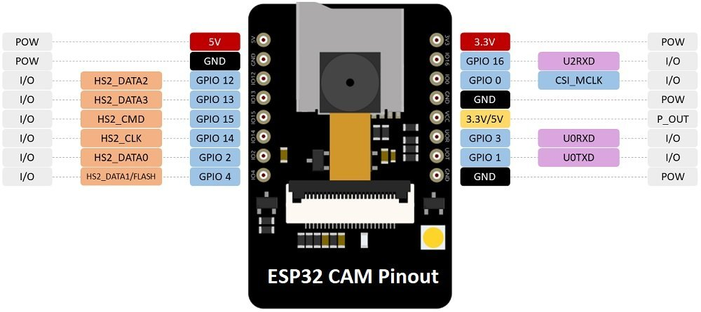
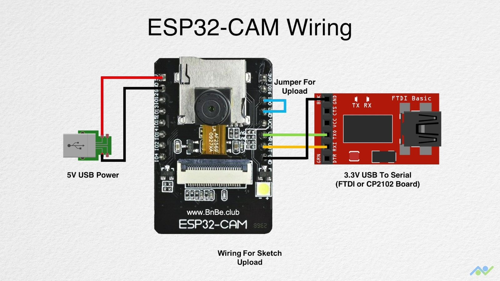

# ESP32-CAM Integration Guide

## Hardware

- **Board**: AI-Thinker ESP32-CAM (must have **PSRAM** — the black PCB version)
- **SoC**: ESP32-S (dual-core Xtensa LX6, up to 240 MHz, 520 KB SRAM + 4 MB PSRAM)
- **Camera**: OV2640 2MP sensor via FPC connector (also compatible with OV7670)
- **Flash LED**: GPIO 4 (white bright LED on the board)
- **Power**: 5V 2A minimum — USB from many computers may be insufficient, use a dedicated power supply if experiencing resets
- **WiFi**: 802.11 b/g/n, 2.4 GHz, up to 150 Mbps
- **Bluetooth**: v4.2 BR/EDR + BLE
- **SD Card**: MicroSD slot, supports up to 4 GB (FAT32), 1-bit or 4-bit mode
- **Antenna**: Onboard PCB antenna (2 dBi gain)

### Board Components

| Component | Description |
|-----------|-------------|
| ESP32-S | Main SoC with dual-core CPU, WiFi/BT |
| OV2640 | 2MP camera sensor via FPC ribbon cable |
| 4 MB PSRAM | External pseudo-static RAM for camera buffers |
| Voltage Regulator | 3.3V LDO from 5V input |
| Tantalum Capacitor | Power supply filtering |
| IPEX Connector | External antenna option (NC by default) |
| Reset Button | Restarts the module |
| Flash LED | High-brightness white LED for illumination |
| MicroSD Holder | SPI-mode storage up to 4 GB |

### Schematic Overview

The ESP32-CAM schematic follows this architecture:

```
5V ──► Voltage Regulator (3.3V) ──► ESP32-S, PSRAM, Camera
         │
         └──► GPIO 32 controls Q2 MOSFET ──► CSI voltage regulators (2.8V, 1.2V)
                                                │
                                                └──► OV2640 camera power

GPIO 0 ──► Camera XCLK (also used for boot mode detection)
GPIO 4 ──► Flash LED + SD card DATA1 (shared)
GPIO 33 ──► Onboard red LED (active LOW)
```

The camera's PWDN pin is tied to GPIO 32 — setting GPIO 32 HIGH powers down the camera
CSI regulators. This is useful for camera reset without full board reboot.

[Full schematic (PDF)](https://github.com/SeeedDocument/forum_doc/blob/master/reg/ESP32_CAM_V1.6.pdf)

### Pinout Reference



*AI-Thinker ESP32-CAM pinout — 16 pins broken out from the ESP32-S module.*

| Pin | Label | Function | Notes |
|-----|-------|----------|-------|
| 1 | GND | Ground | |
| 2 | GPIO 2 | SD_D0 / ADC2_CH2 | Must be LOW during boot; shared with SD card |
| 3 | GPIO 4 | Flash LED / SD_D1 / ADC2_CH0 | Shared with SD card and flash |
| 4 | GPIO 12 | SD_D2 / ADC2_CH5 | Must be LOW during boot; shared with SD card |
| 5 | GPIO 13 | SD_D3 / ADC2_CH4 | Shared with SD card |
| 6 | GPIO 14 | SD_CLK / ADC2_CH6 | Shared with SD card |
| 7 | GPIO 15 | SD_CMD / ADC2_CH3 | Must be HIGH during boot; shared with SD card |
| 8 | GPIO 14 | SD_CLK | Shared with SD card |
| 9 | GPIO 0 | Boot mode / Camera XCLK | HIGH = normal boot, LOW = flash mode |
| 10 | GPIO 16 | UART2_RX | Only RX broken out from UART2 |
| 11 | GPIO 10 | (data) | Internal use / camera data |
| 12 | GPIO 9 | (data) | Internal use / camera data |
| 13 | 5V | Power input | 5V ±10% — recommended for stable operation |
| 14 | 3.3V | Power input/output | Can power board but less stable |
| 15 | GPIO 1 | UART0_TX | Serial output for flashing and debug |
| 16 | GPIO 3 | UART0_RX | Serial input for flashing and debug |
| 17 | VCC | Power output | 3.3V by default (configurable to 5V via zero-ohm jumper) |
| 18 | GND | Ground | |

#### GPIO Safety Guide

Not all pins are safe to use in every project. Here is the risk assessment:

| GPIO | Safe? | Reason |
|------|-------|--------|
| 0 | Use with caution | Must be HIGH during boot, LOW for flashing; also drives camera XCLK |
| 1 | Use with caution | UART TX — used for flashing and debug output |
| 2 | Avoid with SD card | Must be LOW during boot; SD_D0 when card present |
| 3 | Use with caution | UART RX — used for flashing |
| 4 | Avoid with SD card | Shared with flash LED and SD_D1 |
| 12 | Avoid with SD card | Must be LOW during boot; SD_D2 when card present |
| 13 | Avoid with SD card | SD_D3 when card present |
| 14 | Avoid with SD card | SD_CLK when card present |
| 15 | Avoid with SD card | Must be HIGH during boot; SD_CMD when card present |
| 16 | Safe | UART2 RX — not shared with SD card or boot |
| 33 | Safe | Onboard red LED (active LOW) |

> **Safe GPIOs** (no conflicts): GPIO 16, GPIO 33

#### Power Pins

| Pin | Voltage | Current | Notes |
|-----|---------|---------|-------|
| 5V | 5V ±10% | Up to 2A | Recommended power input |
| 3.3V | 3.3V | Limited | Can power board but brownouts common |
| GND | 0V | — | Three GND pins available |
| VCC | 3.3V (default) | Output | Can be jumpered to 5V via zero-ohm resistor near pin |

> **Always power via 5V pin.** The 3.3V pin bypasses the regulator and is not
> recommended for reliable operation, especially with WiFi active.

### Camera Connector Pins (FPC)

The OV2640 connects to the ESP32 through a 24-pin FPC connector with these
assignments:

| OV2640 Pin | ESP32 GPIO | Code Variable |
|------------|------------|---------------|
| D0 | GPIO 5 | Y2_GPIO_NUM |
| D1 | GPIO 18 | Y3_GPIO_NUM |
| D2 | GPIO 19 | Y4_GPIO_NUM |
| D3 | GPIO 21 | Y5_GPIO_NUM |
| D4 | GPIO 36 | Y6_GPIO_NUM |
| D5 | GPIO 39 | Y7_GPIO_NUM |
| D6 | GPIO 34 | Y8_GPIO_NUM |
| D7 | GPIO 35 | Y9_GPIO_NUM |
| XCLK | GPIO 0 | XCLK_GPIO_NUM |
| PCLK | GPIO 22 | PCLK_GPIO_NUM |
| VSYNC | GPIO 25 | VSYNC_GPIO_NUM |
| HREF | GPIO 23 | HREF_GPIO_NUM |
| SDA | GPIO 26 | SIOD_GPIO_NUM |
| SCL | GPIO 27 | SIOC_GPIO_NUM |
| PWDN | GPIO 32 | PWDN_GPIO_NUM |

> GPIO 0 serves dual purpose: camera XCLK and boot mode selection. During flash,
> the camera is not powered (GPIO 32 = HIGH), so XCLK is inactive and GPIO 0
> can be pulled LOW for flashing mode.

## Flashing the Firmware

### Prerequisites

- Arduino IDE (1.8.x or 2.x)
- ESP32 board package v2.x installed via Boards Manager
- USB-to-UART bridge (e.g., FTDI232) at **5V** (not 3.3V!)
- Female-to-female jumper wires

### Wiring (FTDI Programmer)



| ESP32-CAM | FTDI Programmer |
|-----------|-----------------|
| GND | GND |
| 5V | VCC (5V) |
| GPIO 3 (U0R) | TX |
| GPIO 1 (U0T) | RX |
| GPIO 0 | GND *(only during flashing)* |

> **Important:**
> - Set FTDI jumper to **5V** (not 3.3V)
> - Connect GPIO 0 to GND *only while uploading* — disconnect after
> - Some newer ESP32-CAM boards have the EN pin on the GND-adjacent pin;
>   use the GND pin labeled on the silkscreen instead

Alternatively, use the **ESP32-CAM-MB programmer** — a USB-to-UART shield that
plugs directly onto the board (no wiring needed):


### Board Configuration

| Setting | Value |
|---------|-------|
| Board | AI Thinker ESP32-CAM |
| Upload Speed | 115200 |
| Flash Frequency | 80MHz |
| Flash Mode | QIO |
| Partition Scheme | Huge APP (3MB No OTA/1MB SPIFFS) |
| PSRAM | Enabled |

### Steps

1. Open `esp32-cam-firmware/esp32-cam-firmware.ino` in Arduino IDE
2. Install dependencies via Boards Manager: `ESP32 by Espressif Systems` v2.x
3. Set your WiFi credentials at the top of the file:
   ```cpp
   #define WIFI_SSID "YourWiFiSSID"
   #define WIFI_PASSWORD "YourWiFiPassword"
   ```
4. Select **Tools > Board > ESP32 Arduino > AI Thinker ESP32-CAM**
5. Select the correct COM port
6. Hold GPIO 0 to GND, press reset, release GPIO 0
7. Click **Upload**
8. Open **Serial Monitor** at 115200 baud to see the assigned IP

> If you see `FB-OVF` errors in the serial log, you have an older firmware.
> The current firmware boots the camera AFTER WiFi connects to prevent this.

### Power Consumption

| State | Current @ 5V |
|-------|-------------|
| Deep-sleep | ~6 mA |
| Modem-sleep | <20 mA |
| Idle (WiFi on) | ~180 mA |
| Flash off | ~180 mA |
| Flash on (max brightness) | ~310 mA |

Use a power supply capable of at least **500 mA** for reliable operation.

### Troubleshooting Flashing

| Symptom | Cause | Fix |
|---------|-------|-----|
| "Failed to connect: timed out" | GPIO 0 not grounded | Hold GPIO 0 to GND, press RST, release GPIO 0 |
| Brownout detector triggered | Insufficient power | Set FTDI to 5V, use USB port directly (not hub) |
| "Invalid head of packet" | Wrong voltage/baud | Use 5V, try 74880 baud for bootloader messages |
| Camera init failed 0x20001 | Loose FPC cable | Re-seat the camera ribbon cable |
| No IP in Serial Monitor | WiFi credentials wrong | Check SSID/password, verify router allows new devices |

## Firmware Architecture

The firmware runs two HTTP servers concurrently using ESP-IDF's `esp_http_server`:

```
Port 80 (camera_httpd)
├── GET /status   → JSON sensor state
├── GET /control  → Set sensor parameter (?var=X&val=Y)
└── GET /capture  → Single JPEG frame

Port 81 (stream_httpd)
└── GET /stream   → Multipart MJPEG stream
```

Each endpoint runs in its own FreeRTOS task, so streaming never blocks control commands.

## Connecting

### Network Mode (Recommended)

1. ESP32 connects to your WiFi router on boot
2. Find its IP via Serial Monitor, router DHCP list, or the app's **Scan** button
3. Enter the IP in the app or tap the discovered camera


*Mode selection: choose between Network IP or Standalone AP*


*Enter the camera IP or tap Scan to auto-discover*


*Scanning the local network for ESP32-CAM devices*

### Standalone AP Mode

1. If WiFi connection fails, ESP32 creates its own network: `ESP32-CAM-AP` (no password)
2. Phone connects to that network
3. Default IP: `192.168.4.1`
4. Use **Configure Camera Wi-Fi (BLE)** to send router credentials via Bluetooth

### mDNS

The firmware advertises as `esp32cam.local`. Not all networks resolve mDNS reliably —
use IP directly if mDNS fails.

## Control Commands

All controls go to `http://{ip}/control?var={name}&val={value}`:

### Flash
- `flash=1` — on
- `flash=0` — off

### Resolution (`framesize`)
| Value | Resolution |
|-------|-----------|
| 10 | UXGA (1600×1200) |
| 7 | SVGA (800×600) |
| 6 | VGA (640×480) |
| 5 | CIF (400×296) |

### Image Adjustment
| var | Range |
|-----|-------|
| `quality` | 6–15 (lower = smaller file) |
| `brightness` | -2 to 2 |
| `contrast` | -2 to 2 |
| `saturation` | -2 to 2 |
| `sharpness` | -3 to 3 |

### Flip/Mirror
- `hmirror=1` — horizontal mirror
- `vflip=1` — vertical flip

### Auto Settings
| var | 0/1 | Description |
|-----|-----|-------------|
| `awb` | off/on | Auto white balance |
| `agc` | off/on | Auto gain control |
| `aec` | off/on | Auto exposure control |
| `ae_level` | -3 to 3 | AE compensation |

### Effects
- `special_effect` 0–6 (0=none, 1=negative, 2=grayscale, etc.)
- `wb_mode` 0–4 (white balance presets)

## Status Endpoint

`GET http://{ip}/status` returns all sensor state as JSON:

```json
{"flash":false,"framesize":7,"quality":10,"brightness":0,
 "contrast":0,"saturation":0,"sharpness":0,"hmirror":0,
 "vflip":0,"ae_level":0,"awb":1,"agc":1,"aec":1,
 "special_effect":0,"wb_mode":0}
```

## Troubleshooting

| Symptom | Cause | Fix |
|---------|-------|-----|
| Camera not found | Different subnet | Use Scan in app or check router DHCP list |
| FB-OVF at boot | Camera init before WiFi stable | Flash current firmware (moves init after WiFi) |
| Black stream | Wrong resolution/quality | Tap Refresh or lower quality slider |
| Emulator no camera | NAT isolation | Server-side scan auto-detected (10.0.2.x) |
| Stream freezes | Power brownout | Use 5V 2A supply, not USB from PC |
| Can't flash ESP32 | GPIO 0 not held low | Hold GPIO 0 to GND during reset |
| BLE not working | `WIFI_SSID` defined | BLE only active in AP fallback mode |
| Camera won't init after reset | PWDN not cycled | Set GPIO 32 HIGH for 100ms then LOW to power-cycle camera |
| SD card errors | Pin conflicts | Use 1-bit mode: `SD_MMC.begin("/sdcard", true)` |
| Brownout on WiFi enable | Weak PSU | Add 470 µF capacitor across 5V and GND |
| Board won't boot on power-up | Unstable EN pin | Add 10 µF capacitor between EN and GND |

## BLE Provisioning

When WiFi credentials are NOT pre-defined (remove `#define WIFI_SSID` line),
the firmware enables BLE:

1. ESP32 advertises as `ESP32-CAM-SETUP`
2. App scans for BLE devices in Standalone mode
3. User enters router SSID + password
4. ESP32 connects to WiFi, disables SoftAP and BLE
5. Camera server starts on the local IP

This flow is handled in `DiscoveryScreen.tsx` via `BleService`.

## References

- [Random Nerd Tutorials — ESP32-CAM Guide](https://randomnerdtutorials.com/esp32-cam-video-streaming-face-recognition-arduino-ide/)
- [Microcontrollers Lab — ESP32-CAM Pinout](https://microcontrollerslab.com/esp32-cam-ai-thinker-pinout-gpio-pins-features-how-to-program/)
- [Last Minute Engineers — ESP32-CAM Pinout Reference](https://lastminuteengineers.com/esp32-cam-pinout-reference/)
- [ESP32-CAM Schematic (Seeed)](https://github.com/SeeedDocument/forum_doc/blob/master/reg/ESP32_CAM_V1.6.pdf)
- [Espressif ESP32-CAM Datasheet](https://www.espressif.com/en/products/modules/esp32)
